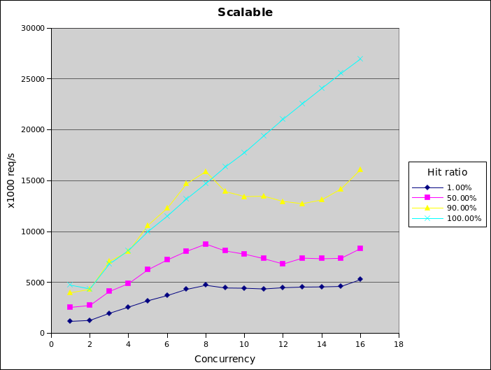
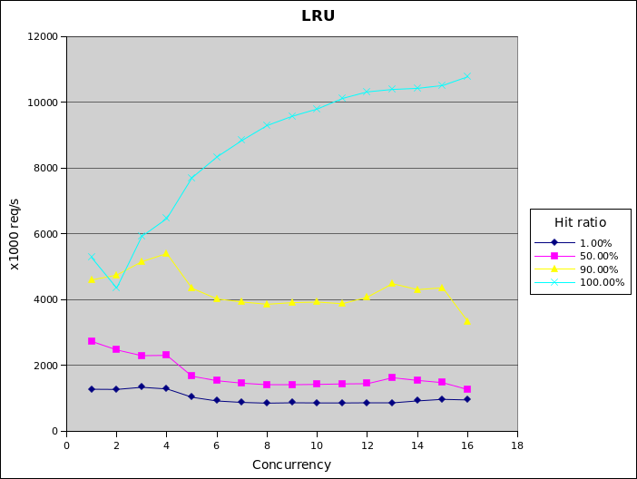
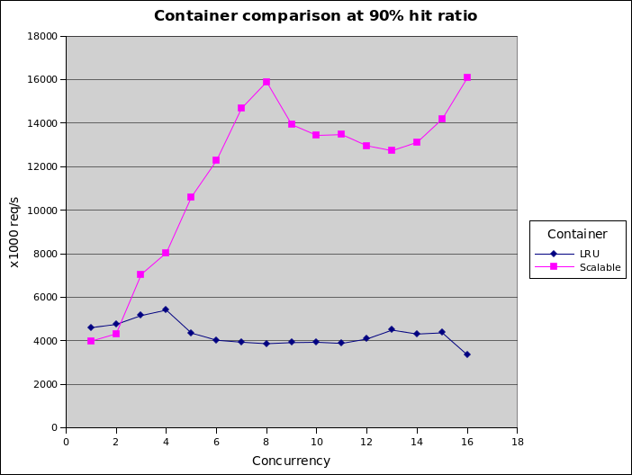
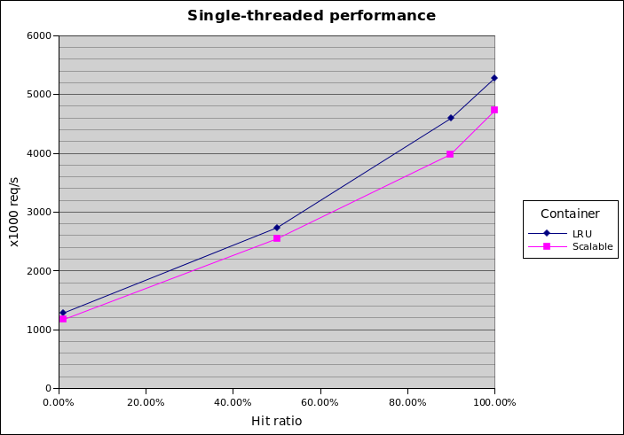

# Benchmarks

* Intel(R) Xeon(R) CPU E5-2450 v2 @ 2.50Ghz
* 16 cores
* 64GB RAM

Tested with benchmark.cpp with container size of 10000, demand size set to achieve desired hit ratio. The low hit ratio tests show insert/evict performance, whereas the high hit ratio tests show lookup performance.

